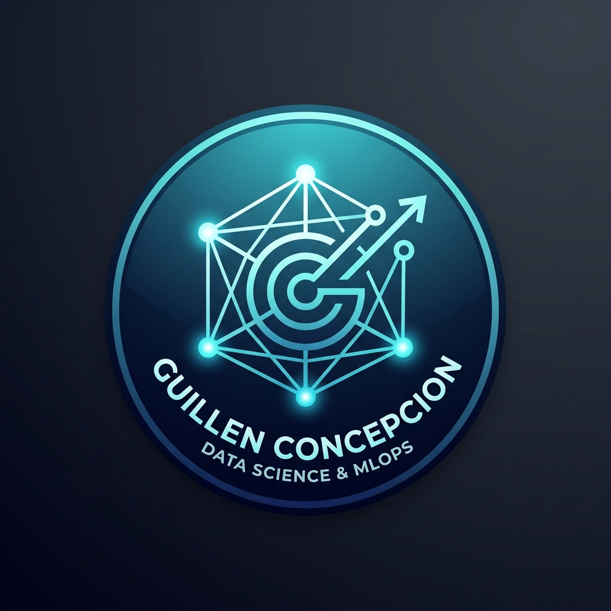

# 🤖 Customization Rules & Agent Directives (.agents/AGENTS.md)

  
  <h2>Guillén Concepción</h2>
  
<b>Senior Data Scientist & MLOps Engineer</b>

  

    <a href="mailto:guillenconcepcion@gmail.com">✉️ Email</a> •
    <a href="https://github.com/GuillenConcepcion">🐙 GitHub</a> •
    <a href="https://www.linkedin.com/in/guillen-concepcion-25266b127">💼 LinkedIn</a>
  

---

## 👨‍💻 Perfil del Usuario & Enfoque Profesional
- **Nombre:** Guillén Concepción
- **Rol:** Senior Data Scientist & MLOps Engineer
- **Enfoque Profesional:** Experto en diseño, desarrollo y despliegue de soluciones integrales de Inteligencia Artificial. Pragmático y centrado en el valor de negocio, abarcando desde la fase de investigación (CRISP-DM) hasta sistemas de producción escalables, resilientes y auditables utilizando arquitecturas Cloud-Native y prácticas MLOps.

---

## 📋 Reglas Generales para el Agente (IA)

1. **Documentación y READMEs:** Cuando el usuario pida crear o actualizar un README y añadir sus credenciales o perfil, utilizar SIEMPRE la información de contacto listada arriba.
2. **Avatar / Logo:** Utilizar la imagen `images/guillen_logo.png` en las cabeceras de documentación y reportes.
3. **Estilo de Comunicación:** Mantener un tono técnico y profesional de nivel "Senior" al documentar arquitecturas, MLOps (Podman, Docker, MLflow, uv, etc.) y código de Machine Learning / RPA / Workflows.
