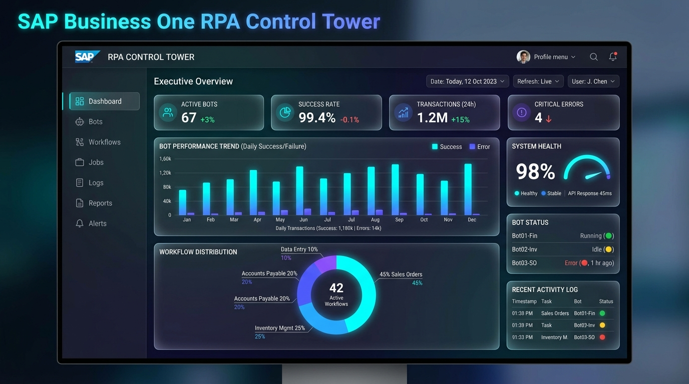
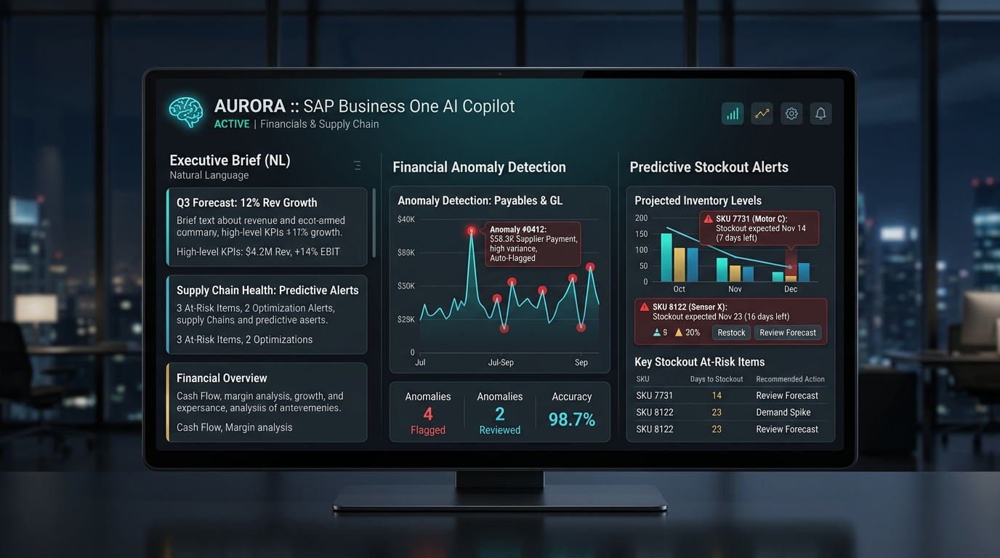
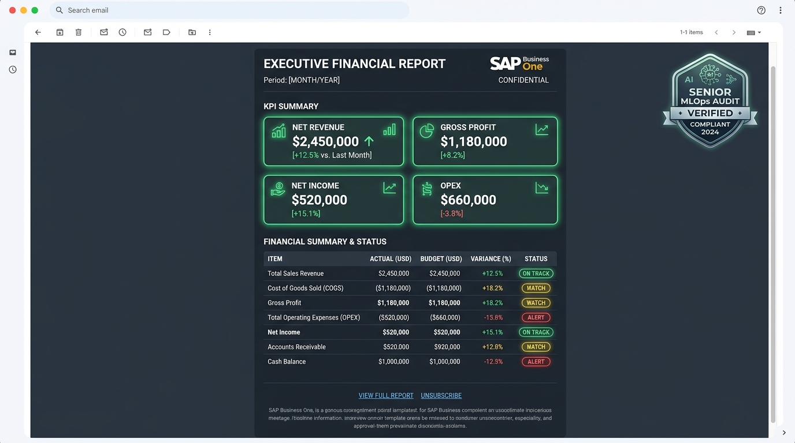
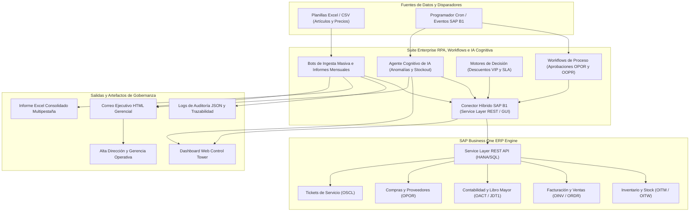

# ⚡ SAP Business One Enterprise RPA & AI Control Tower

> **Plataforma Enterprise de Automatización Robótica de Procesos (RPA), Orquestación de Workflows Multidepartamentales, Motores de Decisión de Negocio e Inteligencia Artificial Cognitiva (Agentic AI Copilot) para SAP Business One.**

---


## 🛠️ Stack Tecnológico de la Plataforma

La arquitectura de la solución integra tecnologías modernas de nivel producción y MLOps:

- **Core & Backend Logic:** Python 3.10+ (Pandas, NumPy, OpenPyXL, Requests, Unittest).
- **ERP Integration Engine:** SAP Business One Service Layer (REST API / OData v4) + Conector Híbrido de Simulación y Fallback Transparente.
- **Agentic AI & Inferencia Cognitiva:** Modelos de Detección Estadística de Anomalías (Z-Score Invariant), Algoritmos Predictivos de Quiebre de Stock y Síntesis Gerencial en Lenguaje Natural (Executive Brief).
- **Frontend & UI/UX Design System:** HTML5 Semántico, Vanilla CSS3 (Glassmorphism, Dark Mode, Typography Google Inter & Outfit), Chart.js (Visualizaciones Financieras y de Rendimiento) y JavaScript ES6+.
- **Infraestructura MLOps & Contenedores:** Podman / Docker (Imágenes Multi-Stage), Podman-Compose, Servidor HTTP Multithreaded y Suite de Pruebas Postman API REST.

---

## 🎯 Finalidades y Objetivos de Negocio del Proyecto

La suite tiene como propósito fundamental transformar las operaciones manuales y fragmentadas en SAP Business One mediante 4 pilares clave:

1. **⚡ Eliminación de Errores y Eficiencia Operativa (RPA Ingestion):**
   Automatización completa del proceso repetitivo de actualización masiva de ítems y listas de precios desde planillas Excel, alcanzando 100% de precisión y velocidad de procesamiento de >5 registros/segundo.
2. **📊 Consolidación e Inteligencia Financiera Gerencial:**
   Extracción multimodular autónoma (Ventas, Contabilidad, Inventarios), computación automática de utilidad operacional y generación de informes ejecutivos en Excel multipestaña y plantilla HTML gerencial por correo electrónico.
3. **👁️ Visibilidad en Tiempo Real y Eliminación de Cuellos de Botella:**
   Trazabilidad completa del pipeline de ventas ($\text{ORDR} \rightarrow \text{ODLN} \rightarrow \text{OINV}$) mediante tableros Kanban interactivos, identificando proactivamente órdenes de compra retenidas (>48h) o desabastecimiento en almacén.
4. **🔄 Orquestación de Procesos y Gobernanza de Decisiones con IA:**
   Automatización de aprobaciones de compras (OPOR $> \$10,000$ USD), conversión autónoma de oportunidades ganadas (OOPR), aplicación dinámica de matriz de descuentos VIP y priorización SLA de llamadas de servicio (OSCL).

---

## 🖼️ Capturas y Artefactos Visuales del Sistema

### 1. Dashboard Web de Control Tower RPA e Inteligencia Financiera


### 2. Agente Cognitivo de IA (Inferencia de Anomalías & Riesgo de Cadena de Suministro)


### 3. Reporte Ejecutivo Gerencial HTML Despachado por Email


---

## 📦 Categorías de Solución & Artefactos Enterprise

La suite está estructurada en 4 pilares fundamentales de automatización e inteligencia para **SAP Business One**:

### 1. 🤖 Artefactos de Automatización (RPA & Batch Ingestion)
- **Actualización Masiva de Datos de Artículos (`item_mass_update_bot.py`):** Ingesta automática de planillas Excel/CSV a SAP B1 mediante la Service Layer REST API / UI Automation abstraction. Elimina al 100% errores de transcripción manual con logs de auditoría en JSON (`audit_log_item_update.json`).
- **Generación de Informes Mensuales (`monthly_report_bot.py`):** Extracción autónoma multimodular (Contabilidad, Ventas e Inventarios), consolidación de KPIs en Excel multipestaña (`Informe_Mensual_SAP_B1.xlsx`) y plantilla HTML de correo ejecutivo (`email_report_executive.html`).

### 2. 👁️ Artefactos de Visibilidad de Procesos (Order Pipeline & Bottlenecks)
- **Visibilidad del Ciclo de Ventas (`sales_process_visibility_bot.py`):** Monitoreo en tiempo real de órdenes de venta ($\text{ORDR} \rightarrow \text{ODLN} \rightarrow \text{OINV}$). Identificación proactiva de cuellos de botella en aprobaciones de crédito pendientes (>48h), retrasos en picking de almacén e inventario crítico (`sales_process_visibility.json`).

### 3. 🔄 Artefactos de Proceso (Workflows Multidepartamentales)
- **Aprobación de Órdenes de Compra (`purchase_order_approval_workflow.py`):** Flujo automático al crear órdenes de compra (OPOR). Si el monto excede $10,000 USD, la solicitud se direcciona a Gerencia de Compras, actualiza el sistema y notifica a Finanzas (`po_approval_workflow.json`).
- **Gestión de Oportunidades a Pedidos (`sales_opportunity_workflow.py`):** Conversión automática de Oportunidades (OOPR) a Pedidos (ORDR) desencadenando verificación de stock y asignación de agente logístico (`sales_opportunity_workflow.json`).

### 4. ⚡ Artefactos de Decisión (Motores de Reglas de Negocio & IA Cognitiva)
- **Reglas de Descuento y Precios Dinámicos (`pricing_discount_decision_engine.py`):** Matriz condicional que aplica descuentos especiales (15% - 25%) basados en clientes VIP e historial acumulado de compras (`pricing_discount_decision_engine.json`).
- **Priorización de Tickets de Servicio SLA (`service_ticket_priority_engine.py`):** Clasificación automática de prioridad alta/crítica (SLA 2 a 4 horas) para tickets de servicio (OSCL) según contrato del cliente (`service_ticket_priority_engine.json`).
- **Agente Cognitivo de IA (`cognitive_ai_agent.py`):** Detección estadística de anomalías financieras (Z-Score > 1.2), inferencia predictiva de quiebre de stock y síntesis gerencial en lenguaje natural (`cognitive_ai_insights.json`).

---

## 🏗️ Arquitectura del Sistema



---

## 💻 Guía de Uso & Ejecución

### Opción A: Dashboard Web Interactivo (Control Tower)
Lance el servidor del Dashboard para monitoreo de métricas, pipelines Kanban y gráficos en tiempo real:

```bash
python run_dashboard.py
```
Acceda desde su navegador a: **`http://localhost:8050`**

---

### Opción B: Ejecución por Banderas CLI

```bash
# 1. Bot de Actualización Masiva de Artículos
python main_rpa_suite.py --bot1

# 2. Bot de Informes Mensuales Financieros
python main_rpa_suite.py --bot2

# 3. Bot de Visibilidad de Procesos de Ventas (Pipeline Kanban)
python main_rpa_suite.py --bot3

# 4. Artefactos de Proceso (Workflows OPOR & OOPR)
python main_rpa_suite.py --workflows

# 5. Artefactos de Decisión (Descuentos VIP & Priorización Tickets SLA)
python main_rpa_suite.py --decisions

# 6. Agente Cognitivo de IA (Detección Anomalías & Predicción Stock)
python main_rpa_suite.py --ai

# 🚀 Ejecutar Suite Completa Enterprise
python main_rpa_suite.py --all
```

---

## 🧪 Pruebas Automatizadas & Entorno Virtual

```bash
# 1. Creación y activación del Entorno Virtual (venv)
python -m venv venv

# En Windows PowerShell:
.\venv\Scripts\activate
# En Linux / macOS:
source venv/bin/activate

# 2. Instalación de dependencias
pip install -r requirements.txt

# 3. Ejecución de suite de pruebas unitarias
python -m unittest discover -s tests -p "test_*.py"
```

---

## 🐳 Contenedorización MLOps (Podman / Docker)

Construcción y ejecución cloud-native utilizando **Podman** o **Docker**:

```bash
# Construir la imagen del contenedor
podman build -t sap-b1-rpa-suite:latest .

# Ejecutar el contenedor del Dashboard Control Tower (Puerto 8050)
podman run -d -p 8050:8050 --name sap_rpa_dashboard sap-b1-rpa-suite:latest

# Orquestación multi-servicio con podman-compose / docker-compose
podman-compose up -d
```

---

## 🚀 Entorno y Colección de APIs en Postman

El proyecto incluye la colección de peticiones y variables de entorno para **Postman** en el directorio [`postman/`](file:///d:/LabD/sap-b1-rpa-suite/postman/):

1. **Colección API REST:** [`postman/sap_b1_rpa_suite.postman_collection.json`](file:///d:/LabD/sap-b1-rpa-suite/postman/sap_b1_rpa_suite.postman_collection.json)
   - Contiene peticiones formateadas para `/Login`, `/Invoices`, `/Items`, `/PurchaseOrders`, `/ServiceTickets` y endpoints REST del Dashboard (`/audit_log_item_update.json`, `/cognitive_ai_insights.json`).
2. **Entorno de Postman:** [`postman/sap_b1_environment.postman_environment.json`](file:///d:/LabD/sap-b1-rpa-suite/postman/sap_b1_environment.postman_environment.json)
   - Define las variables reutilizables `{{sap_url}}`, `{{CompanyDB}}`, `{{UserName}}`, `{{Password}}` y `{{B1SESSION}}`.

---

## 🛡️ Gobernanza MLOps & Resiliencia Cloud-Native
- **Failover Transparente:** Sandbox de simulación RPA integrado en caso de fallos de red en la Service Layer.
- **Auditabilidad Total:** Registro persistente en JSON/CSV de todas las ejecuciones, decisiones y recomendaciones de IA.
- **Despliegue Contenedorizado:** Listo para producción mediante Podman / Docker o Kubernetes CronJobs.

---
## 👨‍💻 Perfil del Autor y MLOps Lead

<div align="center">
  
  <h3>Guillén Concepción</h3>
  <p><b>Senior Data Scientist & MLOps Engineer</b></p>
  <p>
    <a href="mailto:guillenconcepcion@gmail.com">✉️ Email</a> •
    <a href="https://github.com/GuillenConcepcion">🐙 GitHub</a> •
    <a href="https://www.linkedin.com/in/guillen-concepcion-25266b127">💼 LinkedIn</a>
  </p>
</div>